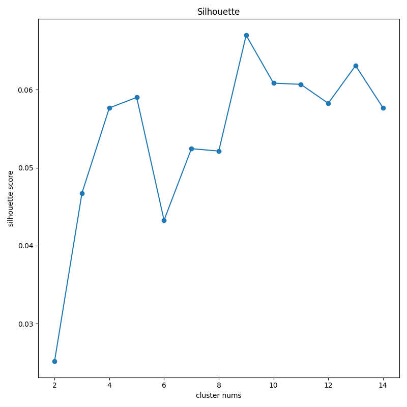
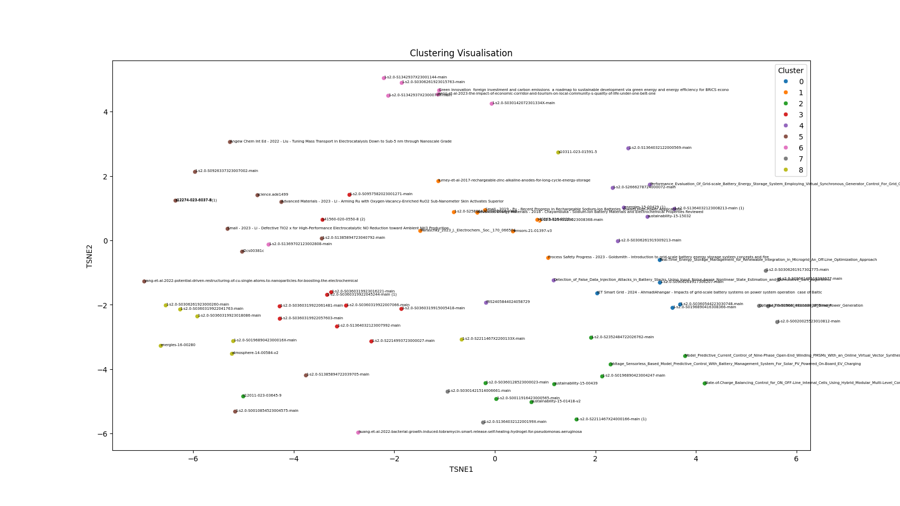

# OR-Takehome

## Overview

This project aims to group academic papers according to their abstracts. Necessary techniques like data preprocessing, text vectorisation using TF-IDF, and K-means clustering, are applied. Results can be found in the output directory. 

## Installation and Setup

To run this project, please follow the following steps:

1. **Install Required Dependencies**:

First, navigate to the project directory in your terminal and execute:

```bash
pip install -r requirements.txt
```

2. **Run main.py**:

Now run:

```bash
python main.py
```

## Analysis Approach

1. **Data Preprocessing**

Abstract Extraction: Extracts text from PDFs, focusing on sections labeled as 'abstract'.

Text Preprocessing: Includes tokenisation, stop-word removal, and lemmatisation using nltk.

2. **Clustering**

Vectorisation: Converts text data into numerical data using TF-IDF vectoriser.

Dimensionality Reduction: Applies PCA to reduce the dimensions of the feature set.
Clustering Algorithm: Uses the K-Means clustering algorithm to group documents based on the processed text data.

## Results





If you are interested in which papers belong to each cluster or the number of clusters (output.csv), the number of papers in each cluster, and the key terms or topics associated with each cluster (summary.csv), please navigate to the output directory.

## Contact

For any additional questions or feedback, please contact the repository maintainer.